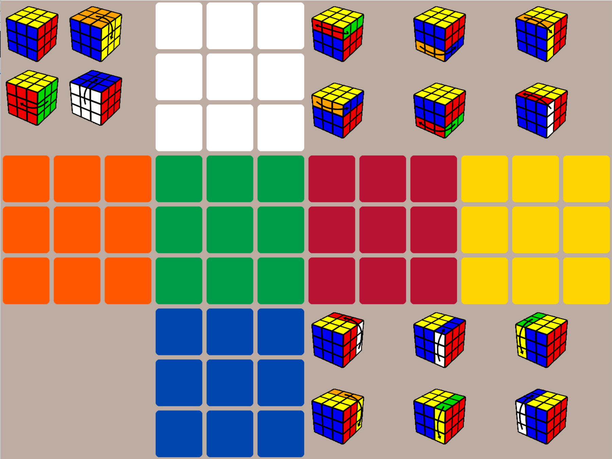

# Rubix Cube
## Requirements
Lib used: pygame & numpy
```
   pip install pygame
   pip install numpy
```
## Logic
- Generate matrix tiles for each face of the rubix cube
- Manipulate matricx to perform rotation movements
- Draw objects and build frame

## Controls
SImply Click on buttons for each rotation.

## Interface
